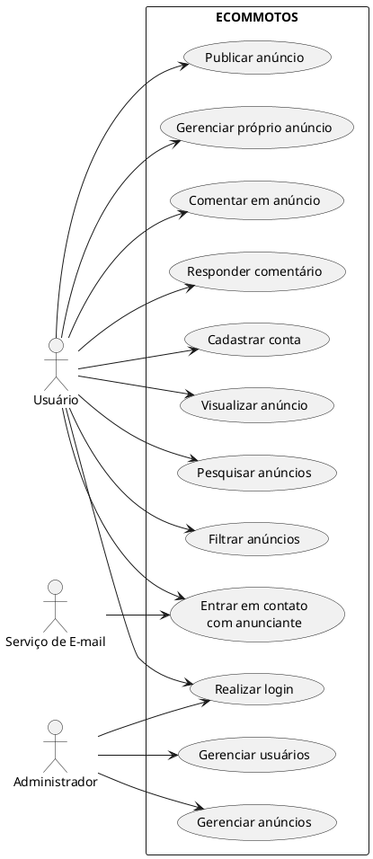

# Ecommotos - Modelagem de negócio

---

# 1. Modelagem de negócio

### 1.1 Contexto do Sistema

O **Ecommotos** é uma plataforma web de anúncios e intermediação para compra e venda de motocicletas usadas e seminovas. A plataforma permite que anunciantes publiquem motocicletas e que compradores pesquisem, filtrem anúncios e entrem em contato com os anunciantes. A negociação e a efetivação da venda ocorrem diretamente entre as partes, não sendo realizadas pela plataforma.

---

### 1.2 Stakeholders

|Ator|Descrição|Relação|
|---|---|---|
Comprador|Usuário (na maioria das vezes entregador) que busca ou demonstra interesse em motocicletas anunciadas|Utiliza a plataforma para pesquisar, filtrar, visualisar e comentar produtos e entrar em contato com anunciantes.
Anunciante|Usuário que cadastra e anuncia uma ou mais motocicletas|Publica anúncios, se comunica com possíveis compradores e gerencia seus próprios anuncios.
Administrador|Responsável pelo gerenciamento da plataforma|	Gerencia usuários, anúncios e funcionamento do sistema.
Serviço de E-mail|Ator externo resposável pelo serviço de e-mail entre compradores e anunciantes|Gerencia os e-mais.

---

### 1.3 Regras de Negócio

|#Id|Regra de negócio|
|---|---|
RN01|Usuários devem possuir uma conta para utilizar as funcionalidades que exigem autenticação.
RN02|Usuários devem realizar login para cadastrar, editar, gerenciar ou comentar em anúncios.
RN03|Os anunciantes podem cadastrar uma ou mais motocicletas.
RN04|Anúncios devem possuir informações obrigatórias da motocicleta, como marca, modelo, ano, cor e cidade, além de outras informações pertinentes para o produto.
RN05|Anúncios podem possuir uma ou mais fotos da motocicleta.
RN06|Os compradores podem filtrar anúncios por atributos como marca, modelo, ano, cor, cidade ou qualquer outro atributo importante para o produto.
RN07|Usuários podem realizar comentários nos anúncios.
RN08|O anunciante e apenas o anunciante pode responder aos comentários realizados nos anúncios de seus produtos.
RN09|Os usuários não podem responder comentários de outros usuários, apenas do anunciante, ou iniciar nova cadeia de comentário.
RN10|O comprador pode entrar em contato com o anunciante por meio do serviço de e-mail da plataforma.
RN11|O endereço de e-mail pessoal do anunciante não deve ser disponibilizado diretamente ao comprador.
RN12|O anunciante pode gerenciar seus próprios anúncios, podendo alterar ou remover informações.
RN13|O administrador possui permissão para gerenciar usuários e anúncios da plataforma.
RN14|A plataforma deve proteger os dados pessoais dos usuários de acordo com a LGPD.
RN15|As informações fornecidas pelos usuários devem ser armazenadas de forma segura, implementando criptografia em dados sensíveis.
RN16|Um anúncio deve permanecer disponível para consulta enquanto estiver ativo na plataforma.
RN17|O sistema deve permitir o acesso à plataforma via Web por dispositivos desktop e mobile.

---

#### 1.4 Casos de Uso por Ator

**Comprador**
|#id|Caso de uso|Regras relacionadas|
|---|---|---|
UC01|Cadastrar usuário|RN01
UC02|Realizar login	|RN01, RN02
UC03|Visualizar anúncio|RN16
UC04|Filtrar anúncios|RN06
UC05|Comentar em anúncio|RN02, RN07, RN09
UC06|Enviar e-mail ao anunciante|RN10, RN11
UC07|Acessar plataforma via Web|RN17

**Anunciante**
|#id|Caso de uso|Regras relacionadas|
|---|---|---|
UC01|Cadastrar usuário|RN01
UC02|Realizar login|RN01, RN02
UC03|Cadastrar anúncio|RN02, RN03, RN04, RN05
UC04|Visualizar anúncio|RN16
UC05|Filtrar anúncios|RN06
UC06|Comentar em anúncio|RN02, RN07, RN09
UC07|Responder comentário|RN02, RN08, RN09
UC08|Gerenciar anúncio|RN02, RN12
UC09|Acessar plataforma via Web|RN17

**Administrador**
|#id|Caso de uso|Regras relacionadas|
|---|---|---|
UC01|Realizar login|RN01, RN02
UC02|Gerenciar usuários|RN13, RN14, RN15
UC03|Gerenciar anúncios|RN13, RN14, RN16
UC04|Acessar plataforma via Web|RN17

**Serviço de E-mail**
|#id|Caso de uso|Regras relacionadas|
|---|---|---|
UC01|Enviar e-mail ao anunciante|RN10, RN11

---

# 2 Diagramas de Caso de Uso

### 2.1 Diagrama de Casos de Uso - ECOMMOTOS

<!-- Comentando abaixo apenas para eu não esquecer -->
<!-- Colocar nas configurações da extensão, senão dará erro:

{
    "python.defaultInterpreterPath": "C:\\Users\\lfran\\AppData\\Local\\Python\\pythoncore-3.14-64\\python.exe",
    "workbench.editor.empty.hint": "hidden",

    "plantuml.server": "https://www.plantuml.com/plantuml",

    "plantuml.commandArgs": [
        
    ]
}
-->


---

#### 2.2 Modelo de Domínio (Diagrama de Classes Conceitual)

```plantuml
@startuml

title Modelo de Domínio - ECOMMOTOS

class Usuario {
    id
    nome
    email
    senha
    dataCadastro
}

class Comprador {
}

class Anunciante {
}

class Administrador {
}

class Anuncio {
    id
    titulo
    descricao
    preco
    cidade
    estado
    dataPublicacao
    status
}

class Motocicleta {
    marca
    modelo
    ano
    cor
    quilometragem
    outrasInformacoes
}

class Foto {
    id
    url
    ordem
}

class Comentario {
    id
    texto
    data
}

class RespostaComentario {
    id
    texto
    data
}

class Contato {
    id
    assunto
    mensagem
    dataEnvio
}

class ServicoEmail {
}

' Especialização de usuários
Usuario <|-- Comprador
Usuario <|-- Anunciante
Usuario <|-- Administrador

' Anúncios
Anunciante "1" -- "0..*" Anuncio : cadastra

Anuncio "1" -- "1" Motocicleta : possui

Anuncio "1" -- "1..*" Foto : possui

' Comentários
Usuario "1" -- "0..*" Comentario : realiza

Anuncio "1" -- "0..*" Comentario : recebe

Comentario "1" -- "0..1" RespostaComentario : possui

Anunciante "1" -- "0..*" RespostaComentario : realiza

' Contato
Comprador "1" -- "0..*" Contato : envia

Anunciante "1" -- "0..*" Contato : recebe

Contato "1" -- "1" Anuncio : refere-se

Contato "1" --> "1" ServicoEmail : utiliza

' Administração
Administrador "1" -- "0..*" Usuario : gerencia

Administrador "1" -- "0..*" Anuncio : gerencia

@enduml


